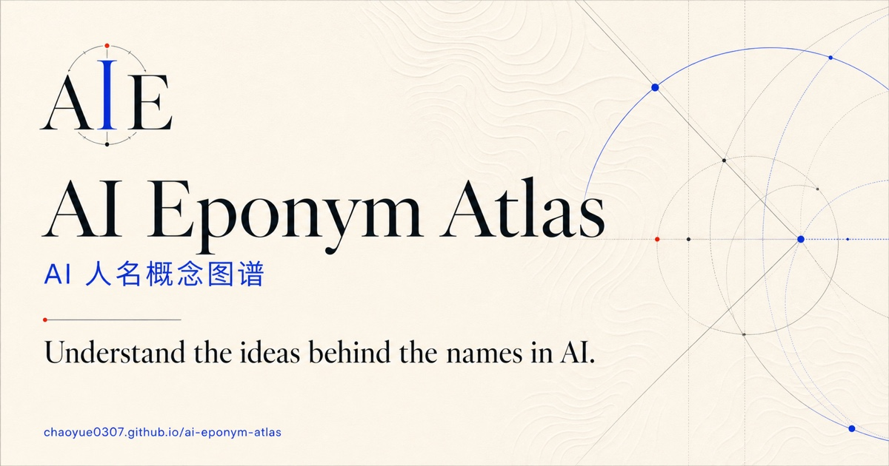
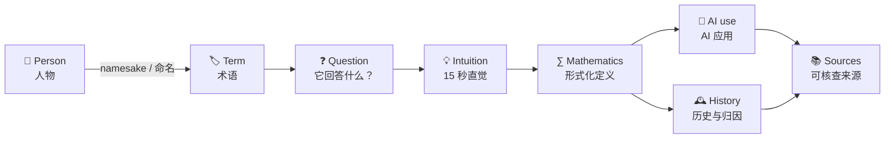
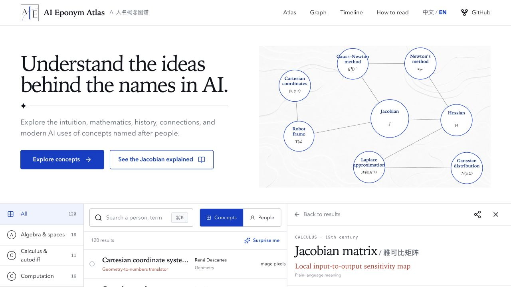
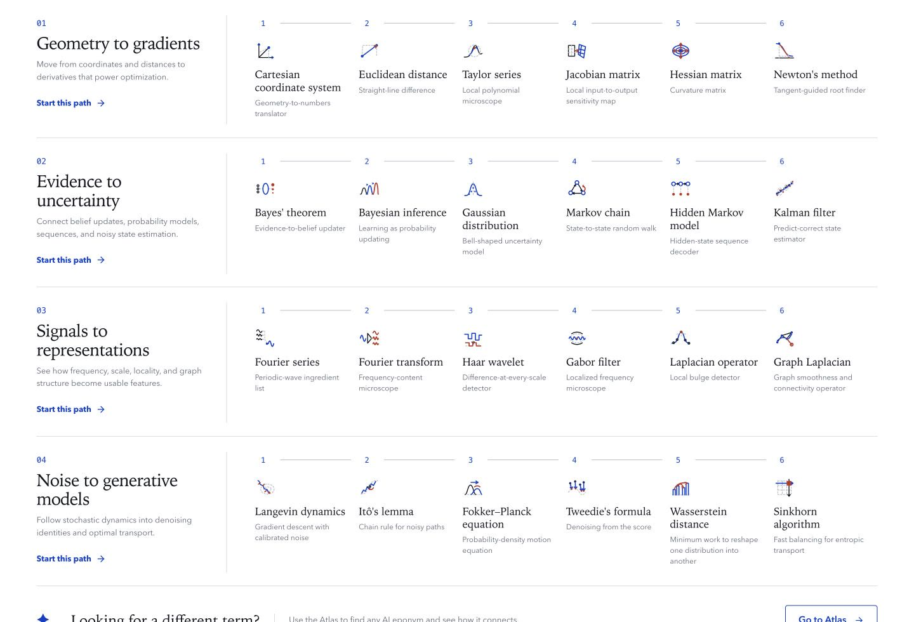
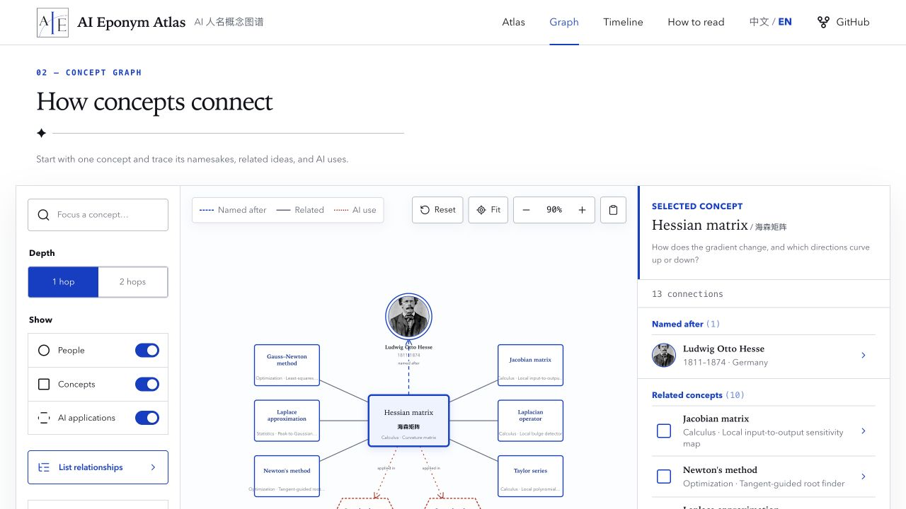
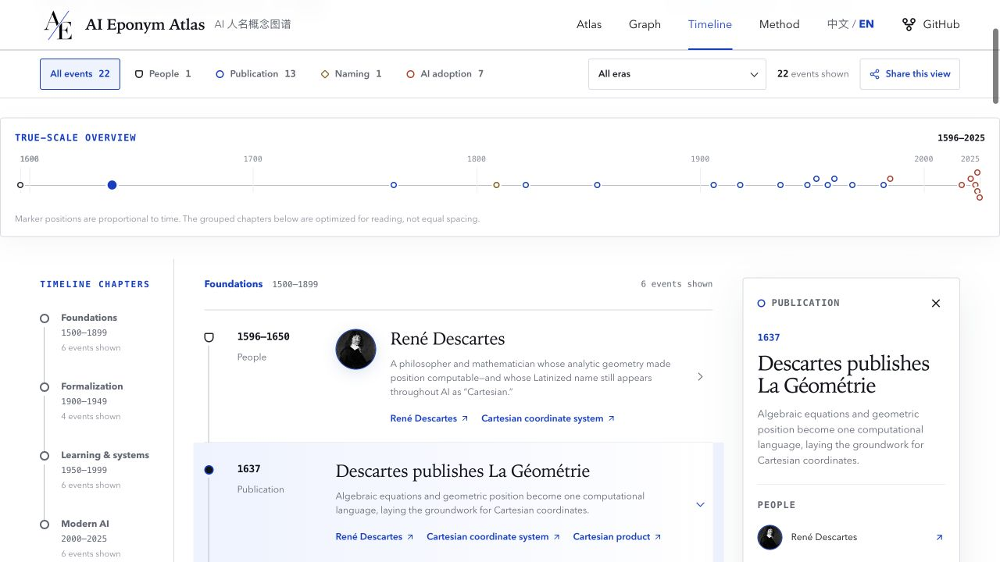
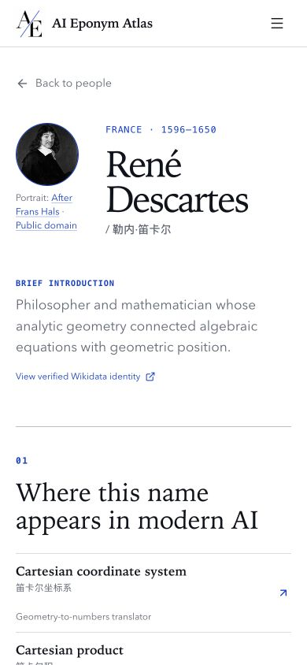
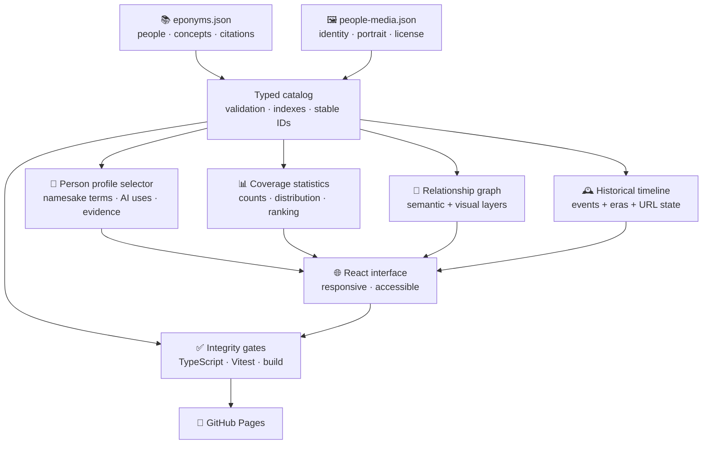

<h1 align="center">AI Eponym Atlas</h1>

<p align="center">
  <strong>AI 人名概念图谱</strong><br>
  <em>Understand the ideas behind the names in AI.</em><br>
  读懂 AI 人名术语背后的思想。
</p>

<p align="center">
  <a href="./LICENSE"></a>
  <a href="./CONTENT_LICENSE"></a>
</p>

<p align="center">
  <a href="https://chaoyue0307.github.io/ai-eponym-atlas/">
    
  </a>
</p>

<p align="center">
  <a href="https://chaoyue0307.github.io/ai-eponym-atlas/"><strong>🌐 Open the live atlas</strong></a>
  ·
  <a href="https://chaoyue0307.github.io/ai-eponym-atlas/#/paths">🧭 Follow a learning path</a>
  ·
  <a href="https://chaoyue0307.github.io/ai-eponym-atlas/#/graph">🔗 Explore relationships</a>
  ·
  <a href="https://chaoyue0307.github.io/ai-eponym-atlas/#/timeline">🕰️ Follow the timeline</a>
  ·
  <a href="https://chaoyue0307.github.io/ai-eponym-atlas/#/atlas?view=people&layout=ranking">📊 Compare catalog coverage</a>
</p>

AI Eponym Atlas explains mathematical and technical concepts named after people
and widely used in artificial intelligence. Start with what a concept does,
then explore its intuition, formal definition, history, connections, and modern
applications.

AI 人名概念图谱逐一解释以人物命名、并广泛用于 AI 的数学与技术术语：它解决什么问题、如何定义、从何而来，以及怎样用于现代 AI。

---

## 📊 What's inside / 图谱内容

Catalog snapshot: **2026-07-31** / 目录快照：**2026-07-31**

| Coverage / 覆盖 | Evidence / 证据 | Experience / 体验 |
| :---: | :---: | :---: |
| **120** concepts / 概念<br>**117** people / 人物<br>**149** person–concept links / 人物—概念连接 | **247** citation links / 引用链接<br>**235** unique source URLs / 唯一来源<br>**78** verified portraits / 核验肖像 | **9** fields / 领域<br>**4** learning paths / 学习路径 |

Every concept has at least two reference links. References are attached at the
concept level and may support a definition, naming history, implementation, or
AI use; follow the relevant source before relying on a specific claim. Every
historical portrait links to its source and license.

每个概念至少有两条参考链接。链接附在概念层级，可能分别支持定义、命名史、实现或 AI 用途；重要主张请继续核对相关来源。每幅历史人物肖像都标注原始来源与许可信息。

All 117 people profiles pair a concise introduction with localized lifespan and
region facts, linked terms carrying their names, deduplicated AI applications,
and evidence grouped by concept. The atlas uses **78 verified real portraits**
and **39 clearly labelled monogram fallbacks**; it does not generate historical
likenesses.

117 个人物页均提供简明介绍、本地化生卒年份与地区信息、承载其姓名的相关术语、去重后的 AI 应用，以及按概念分组的证据。图谱采用 **78 幅经核验的真实肖像**与 **39 个明确标注的姓名首字母占位符**，不生成历史人物形象。

### 🔢 Why 117 people map to 120 concepts / 为什么 117 位人物对应 120 个概念

The audit distinguishes **unique records** from **relationships**. A person can
be linked to several concept entries, while one joint eponym—such as
Gauss–Newton or BFGS—can link to several namesakes. The current catalog is
internally consistent:

- **117 people + 32 additional concept links = 149 person–concept links**
- **149 links − 29 additional co-namesake links = 120 unique concepts**
- **96** people currently have 1 catalogued concept; **15** have 2; **2** have
  3; **3** have 4; and **1** has 5.

核验时需要区分“独立条目”和“关联关系”：一个人物可以对应多个概念，一个复合人名概念也可以关联多位人物。当前目录共有 **149 条人物—概念连接**；96 位人物目前只有 1 个已收录概念，说明目录更重广度，仍有继续加深的空间，并非计数错误。

[](https://chaoyue0307.github.io/ai-eponym-atlas/#/atlas?view=people&layout=ranking)

The [live ranking](https://chaoyue0307.github.io/ai-eponym-atlas/#/atlas?view=people&layout=ranking)
contains all 117 people, supports search and field filters, and opens every
linked person or concept. It measures this catalog's current coverage—not
historical importance or a person's total contributions.

## 🧠 What the names don't tell you / 名字没有告诉你的内容

Cartesian, Gaussian, Bayesian, Markov, Fourier, Jacobian, Hessian, Hilbert,
Shannon—these names preserve intellectual history, but the names themselves
say almost nothing about what the concepts do.

An unfamiliar name becomes a path you can follow:



You can keep the historical term without letting it interrupt understanding:
begin with its function, then continue to the mathematics, history, and AI use.

保留历史名称，也不必让它打断理解：先看概念做什么，再进入数学定义、历史脉络与 AI 用途。

## 🧭 Choose how you explore / 选择探索方式

[](https://chaoyue0307.github.io/ai-eponym-atlas/)

[](https://chaoyue0307.github.io/ai-eponym-atlas/#/paths)

**Guided learning paths** connect short sequences of concepts in a pedagogical
order—without presenting that order as historical causality.

<table>
  <tr>
    <td width="68%">
      
    </td>
    <td width="32%">
      
    </td>
  </tr>
  <tr>
    <td><strong>Relationship explorer</strong><br>Choose a concept, trace the people and ideas around it, and open any connection for context.</td>
    <td><strong>Mobile chronology</strong><br>Compare milestones and open the evidence behind each event on any screen.</td>
  </tr>
  <tr>
    <td>
      
    </td>
    <td>
      
    </td>
  </tr>
  <tr>
    <td><strong>Historical timeline</strong><br>Follow publications, later naming, and AI adoption across more than four centuries.</td>
    <td><strong>People profiles</strong><br>Read a concise introduction and localized facts, then follow terms carrying the name, AI uses, and concept-grouped evidence.</td>
  </tr>
</table>

Portraits, historical claims, and concept relationships link back to documented
sources. [Read the source and image policy →](./docs/PORTRAITS.md)

## ✨ What you can do / 核心能力

| Explore / 探索 | Understand / 理解 |
| --- | --- |
| 🔎 **Meaning-first search** — Search terms, people, aliases, functions, and AI uses. | 💡 **15-second intuition** — Start with the question and intuition before the formula. |
| 🧭 **Guided learning paths** — Follow four short sequences with visible step-by-step progress. | 🧱 **Layered explanations** — Move from question and function to definition, history, use, and evidence. |
| 🧭 **Faceted atlas** — Browse 9 mathematical and AI fields in concept or people mode. | ∑ **Formal definitions** — Read renderable notation and precise mathematical definitions. |
| 🔗 **Relationship graph** — Follow people, related concepts, and concrete applications. | 📚 **Evidence-aware history** — Keep definition, naming history, and AI evidence distinct. |
| 🕰️ **Historical timeline** — Separate a person's life, publication, later naming, and AI adoption. | 🧾 **Canonical terminology** — Keep formal names, aliases, and plain-language labels together. |
| 👤 **People profiles** — Connect concise introductions and localized facts to the terms carrying each name, AI uses, and evidence. | ♿ **Keyboard and mobile friendly** — Explore every view with a keyboard or on a small screen. |
| 📊 **Coverage ranking** — Compare all 117 people by current catalog entries, with search and field-aware counts. | 🔢 **Relationship audit** — See why 120 unique concepts form 149 people-to-concept links. |

### ✅ Three practical ways to use it / 三种实用方式

1. **While reading papers:** search the unfamiliar term and read its question,
   functional label, and intuition first.
2. **While learning systematically:** follow a guided path, then use the graph
   and timeline to widen the context.
3. **While writing or teaching:** verify spelling, notation, attribution, and
   sources before following the references to primary material.

## 🧩 Jacobian matrix, decoded / 读懂雅可比矩阵

Start with the question the Jacobian answers, then connect its intuition to the
definition and uses:

| Layer | Jacobian matrix / 雅可比矩阵 |
| --- | --- |
| **Functional label / 功能标签** | Local input-to-output sensitivity map / 局部输入到输出的敏感度地图 |
| **Question / 问题** | If each input changes slightly, how does every output change? / 每个输入稍微变化时，各个输出会怎样变化？ |
| **Intuition / 直觉** | Arrange first partial derivatives into the best local linear map. / 把一阶偏导排成最佳局部线性映射。 |
| **Definition / 定义** | For $f:\mathbb R^n\to\mathbb R^m$, $J_f(x)_{ij}=\partial f_i/\partial x_j$. |
| **AI uses / AI 用途** | Backpropagation, automatic differentiation, robotics, normalizing flows, and sensitivity analysis. |
| **History / 历史** | Jacobi's determinant work is direct; the full derivative-matrix terminology is later. |
| **Evidence / 证据** | Concept-level references let you check definition, naming history, and modern use as separate claims. |

Use the functional label to get oriented, not as a substitute for the formal
term. Check each intuition against the formal definition and its assumptions.

功能标签用于快速定位，不替代正式术语；理解直觉时，也要对照定义与适用边界。

## 🗺️ What is covered / 收录内容

You will find concepts that:

1. are wholly or partly named after a person;
2. have a clear technical definition in mathematics, statistics, computing,
   control, signal processing, or a closely related field;
3. have direct use or important background value in modern AI; and
4. can be verified with reliable sources.

Explore eponyms used in generative modeling, optimal transport, preference and
ranking models, associative memory, dynamical and geometric learning, numerical
linear algebra, statistical bounds, sequence decoding, and classical vision.
This catalog snapshot is dated **2026-07-31**. Foundational concepts retain
original or authoritative references; active-use claims remain open to newer
evidence and correction.

你可以探索生成建模、最优传输、偏好与排序模型、联想记忆、动力与几何学习、数值线性代数、统计界、序列解码和经典视觉中的人名概念。当前目录快照日期为 **2026-07-31**；基础概念保留原始或权威来源，活跃用途也欢迎用更新证据修订。

> [Read the complete inclusion, exclusion, evidence, preprint, and currency policy →](./docs/COVERAGE.md)

<details>
<summary><strong>Reading historical attributions / 如何理解历史归因</strong></summary>

- An eponym records naming history, not necessarily sole discovery.
- A modern name may postdate the original work by decades.
- Independent discovery, disputed attribution, and regional naming differences
  are preserved rather than flattened.
- “Widely used in AI” changes over time and must be supported by concrete use.
- Functional labels clarify a concept's role but are not standard terminology.
- Use the atlas as a guide to sources, not as a substitute for textbooks or
  primary literature.

人名术语记录的是命名史，并不必然意味着某人独立发现。命名可能晚于原始工作，不同地区和学科也可能采用不同名称。“广泛用于 AI”会随时间变化，因此必须用具体应用证据支持。

</details>

---

## 🛠️ For contributors and maintainers / 贡献与维护

Everything below covers local development, data structure, documentation, and
ways to contribute.

以下内容面向贡献者与维护者，包括本地开发、数据结构、文档和参与方式。

<p>
  <a href="https://github.com/ChaoYue0307/ai-eponym-atlas/actions/workflows/ci.yml"></a>
  <a href="https://github.com/ChaoYue0307/ai-eponym-atlas/actions/workflows/deploy-pages.yml"></a>
</p>

### 🚀 Quick start / 快速开始

Requirements: **Node.js 20.19+** and npm. No environment variables are required
for local development.

```bash
git clone https://github.com/ChaoYue0307/ai-eponym-atlas.git
cd ai-eponym-atlas
npm ci
npm run dev
```

Vite prints the local URL, normally `http://localhost:5173`.

| Command | Purpose |
| --- | --- |
| `npm run dev` | Start the local Vite development server |
| `npm run typecheck` | Check the TypeScript project |
| `npm run lint:docs` | Validate README and documentation Markdown |
| `npm run links:check` | Audit concept, timeline, identity, and portrait-provenance URLs |
| `npm run check` | Run TypeScript, documentation, data/logic tests, and a production build |
| `npm run build` | Build the static production site into `dist/` |
| `npm run preview` | Preview the production build locally |
| `npm run portraits:sync` | Rebuild bounded local portrait assets from audited metadata |
| `npm run portraits:audit -- --search --accepted-only` | Recheck missing-portrait candidates against Wikidata and Wikimedia Commons |

### 🧱 How the repository works / 仓库结构



The site is static and client-side. Stable IDs connect people, concepts,
timelines, graph edges, and media records. Editorial content lives in the JSON
catalog rather than being duplicated inside UI components. Person profiles use
`src/lib/personProfile.ts` to derive connected terms, deduplicated applications,
and concept-grouped evidence from those canonical concept records.

Concept citations support definition, attribution, history, and use claims for
the concept under which they appear. A Wikidata link identifies the person; it
is not presented as a complete biographical source.

> [Read the detailed architecture and source-tree guide →](./docs/ARCHITECTURE.md)

### 📚 Documentation / 文档

| Guide | What it covers |
| --- | --- |
| [Coverage and currency](./docs/COVERAGE.md) | Inclusion rules, evidence tiers, active topics, and known gaps |
| [Contributing](./CONTRIBUTING.md) | Complete schema, editorial style, local checks, Git, and PR checklist |
| [Portrait policy](./docs/PORTRAITS.md) | Identity matching, accepted licenses, attribution, and monogram fallback |
| [Portrait audit](./docs/PORTRAIT_AUDIT.md) | File-by-file identity and license verification record |
| [Generated assets](./docs/GENERATED_ASSETS.md) | Image-generation prompts, refinement, compression, and safeguards |
| [Design system](./docs/DESIGN_SYSTEM.md) | Visual principles, semantic tokens, visualization grammar, responsive and accessibility contracts |
| [Architecture](./docs/ARCHITECTURE.md) | Runtime data flow, modules, routes, and repository map |
| [Deployment](./docs/DEPLOYMENT.md) | GitHub Pages configuration, verification, and troubleshooting |
| [Changelog](./CHANGELOG.md) | Released data and product changes |
| [Code of Conduct](./CODE_OF_CONDUCT.md) | Community participation expectations |
| [Security](./SECURITY.md) | Private vulnerability reporting and supported scope |

### 🤝 Contributing

Contributions are welcome across new concepts, corrections, primary sources,
translation, verified portraits, accessibility, and product features.

1. Search the [current catalog](./content/eponyms.json) and
   [open issues](https://github.com/ChaoYue0307/ai-eponym-atlas/issues).
2. Read [CONTRIBUTING.md](./CONTRIBUTING.md) and keep each change focused.
3. Run `npm run check`, then explain the evidence behind new claims in the PR.

A small, complete, well-sourced contribution is more valuable than a large
batch of placeholders.

一个范围小但证据完整的贡献，比一批只有标题的占位条目更有价值。

### 🗺️ Roadmap

- [x] Searchable atlas with profiles, connections, chronology,
  sources, and sourced historical portraits.
- [x] Guided learning paths with shareable concept-by-concept progress.
- [x] Audited people-to-concept counts with a searchable, field-aware ranking.
- [ ] Typed prerequisite, variant, generalization, duality, and
  easy-to-confuse relationships.
- [ ] Minimal worked examples, boundary conditions, and evidence-role metadata.
- [ ] Versioned downloadable datasets and reusable query interfaces.
- [ ] Broader AI subfields, cross-cultural naming traditions, and more
  languages.

The roadmap describes direction, not fixed release dates. See
[CHANGELOG.md](./CHANGELOG.md) for completed work.

## ⚖️ License and provenance / 许可与来源

| Material | Terms |
| --- | --- |
| Source code | [MIT License](./LICENSE) |
| Original writing, translations, structured data, brand assets, and generated editorial art | [CC BY 4.0](./CONTENT_LICENSE) |
| Third-party historical portraits | Each file's recorded source license; see [portrait policy](./docs/PORTRAITS.md) and [audit](./docs/PORTRAIT_AUDIT.md) |
| Generated decorative assets | Prompt and transformation record in [GENERATED_ASSETS.md](./docs/GENERATED_ASSETS.md) |

Third-party images, quotations, and datasets remain subject to their own
licenses. Contributions are released under the corresponding repository terms.

## 🙏 Acknowledgements / 致谢

Thank you to everyone who verifies definitions, adds historical context,
improves translations, connects ideas, and explains their uses in AI.

感谢每一位帮助核查定义、补充历史、改进翻译、连接概念和解释 AI 用途的贡献者。
