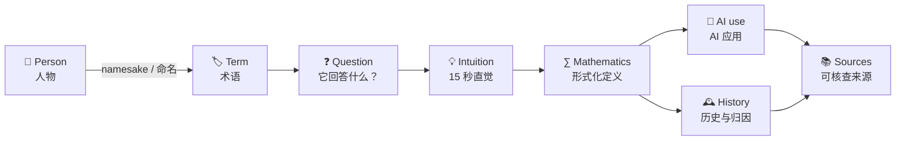

<h1 align="center">AI Eponym Atlas</h1>

<p align="center">
  <strong>AI 人名概念图谱</strong><br>
  <em>From Names to Meaning, From Mathematics to AI.</em><br>
  从人名回到意义，从数学走向 AI。
</p>

<p align="center">
  <a href="https://github.com/ChaoYue0307/ai-eponym-atlas/actions/workflows/ci.yml"></a>
  <a href="https://github.com/ChaoYue0307/ai-eponym-atlas/actions/workflows/deploy-pages.yml"></a>
  <a href="./LICENSE"></a>
  <a href="./CONTENT_LICENSE"></a>
</p>

<p align="center">
  <a href="https://chaoyue0307.github.io/ai-eponym-atlas/">
    
  </a>
</p>

<p align="center">
  <a href="https://chaoyue0307.github.io/ai-eponym-atlas/"><strong>🌐 Open the live atlas</strong></a>
  ·
  <a href="https://chaoyue0307.github.io/ai-eponym-atlas/#/graph">🔗 Explore relationships</a>
  ·
  <a href="https://chaoyue0307.github.io/ai-eponym-atlas/#/timeline">🕰️ Follow the timeline</a>
  ·
  <a href="./CONTRIBUTING.md">🤝 Contribute</a>
</p>

AI Eponym Atlas is a bilingual, meaning-first reference for mathematical and
technical concepts named after people and widely used in artificial
intelligence. It explains what each concept does, how to understand it, where
it came from, how it connects to other ideas, and where it appears in modern AI.

AI Eponym Atlas 面向学习者、研究者与工程师，把以人物命名的数学和技术术语重新翻译成功能、直觉、定义、历史、关系与现代 AI 用途。

---

## 📊 At a glance / 项目概览

Current catalog snapshot: **2026-07-31** · Schema **1.1.0**

| Coverage / 覆盖 | Evidence / 证据 | Experience / 体验 |
| :---: | :---: | :---: |
| **120** concepts / 概念<br>**117** people / 人物 | **247** cited sources / 直接来源<br>**77** verified portraits / 核验肖像 | **9** fields / 领域<br>中文 + English |

Every concept currently has at least two direct references. Historical
portraits are source-verified open works with file-level attribution; the
project does **not** generate synthetic portraits of real people.

每个概念目前至少有两条直接来源。历史人物肖像均来自经身份与许可核验的开放素材；本项目不会生成真实人物的虚构肖像。

## 🧠 Why this exists / 为什么做

Cartesian, Gaussian, Bayesian, Markov, Fourier, Jacobian, Hessian, Hilbert,
Shannon—these names preserve intellectual history, but the names themselves
say almost nothing about what the concepts do.

AI Eponym Atlas adds the missing semantic layer:



The goal is not to erase historical names or invent replacement terminology.
It is to make each name an entry point into understanding rather than a
distraction from it.

目标不是抹去人名或创造一套替代术语，而是让名字成为理解的入口，而不是阅读的障碍。

## 🖼️ See it in action / 产品实景

The images below are captured from the current production website—not from
design mockups.


<table>
  <tr>
    <td width="68%">
      
    </td>
    <td width="32%">
      
    </td>
  </tr>
  <tr>
    <td><strong>Relationship graph</strong><br>Exact, navigable people–concept–application links with one- and two-hop views.</td>
    <td><strong>Verified people profiles</strong><br>Responsive biographies, real open portraits, and visible file-level credits.</td>
  </tr>
</table>

## ✨ What you can do / 核心能力

| Explore / 探索 | Understand / 理解 |
| --- | --- |
| 🔎 **Meaning-first search** — Search terms, people, aliases, functions, and AI uses. | 💡 **15-second intuition** — Start with the question and intuition before the formula. |
| 🧭 **Faceted atlas** — Browse 9 mathematical and AI fields in concept or people mode. | ∑ **Formal definitions** — Read renderable notation and precise mathematical definitions. |
| 🔗 **Relationship graph** — Follow people, related concepts, and concrete applications. | 📚 **Evidence-aware history** — Keep definition, naming history, and AI evidence distinct. |
| 🕰️ **Historical timeline** — Separate a person's life, publication, later naming, and AI adoption. | 🌏 **Bilingual reading** — Maintain Chinese and English terminology together. |
| 👤 **People profiles** — Connect biographies, verified portraits, and named concepts. | ♿ **Progressive and accessible UI** — Use keyboard-navigable HTML/SVG with responsive layouts. |

### Three practical ways to use it

1. **While reading papers:** search the unfamiliar term and read its question,
   functional label, and intuition first.
2. **While learning systematically:** move through fields, people, the
   relationship graph, and the timeline.
3. **While writing or teaching:** verify spelling, notation, attribution, and
   sources before following the references to primary material.

## 🧭 From name to meaning / 从人名到意义

For example, the atlas does not stop at “Jacobian is named after Jacobi”:

| Layer | Jacobian matrix / 雅可比矩阵 |
| --- | --- |
| **Functional label / 功能标签** | Local input-to-output sensitivity map / 局部输入到输出的敏感度地图 |
| **Question / 问题** | If each input changes slightly, how does every output change? / 每个输入稍微变化时，各个输出会怎样变化？ |
| **Intuition / 直觉** | Arrange first partial derivatives into the best local linear map. / 把一阶偏导排成最佳局部线性映射。 |
| **Definition / 定义** | For $f:\mathbb R^n\to\mathbb R^m$, $J_f(x)_{ij}=\partial f_i/\partial x_j$. |
| **AI uses / AI 用途** | Backpropagation, automatic differentiation, robotics, normalizing flows, and sensitivity analysis. |
| **History / 历史** | Jacobi's determinant work is direct; the full derivative-matrix terminology is later. |
| **Evidence / 证据** | Definition/history and modern use are supported by separate direct sources. |

Functional labels are teaching aids, not replacement terminology. Intuitions
must remain consistent with the formal definition and state their limits.

功能标签只是教学辅助，不替代正式术语；直觉必须与形式化定义一致，并保留适用边界。

## 🎯 Scope and currency / 收录边界与时效

The atlas prioritizes concepts that:

1. are wholly or partly named after a person;
2. have a clear technical definition in mathematics, statistics, computing,
   control, signal processing, or a closely related field;
3. have direct use or important background value in modern AI; and
4. can be verified with reliable sources.

Current expanded coverage includes diffusion and stochastic generative
modeling, optimal transport, LLM preference and ranking models, associative
memory, dynamical and geometric learning, numerical linear algebra,
statistical bounds, sequence decoding, and classical vision.

“Current” follows the catalog's editorial cutoff. Foundational claims retain
foundational sources; fast-moving AI relevance is connected to recent primary
work where practical.

> [Read the complete inclusion, exclusion, evidence, preprint, and currency policy →](./docs/COVERAGE.md)

<details>
<summary><strong>Methodological limits / 方法边界</strong></summary>

- An eponym records naming history, not necessarily sole discovery.
- A modern name may postdate the original work by decades.
- Independent discovery, disputed attribution, and regional naming differences
  are preserved rather than flattened.
- “Widely used in AI” changes over time and must be supported by concrete use.
- Functional labels are editorial explanations and may improve over time.
- The atlas is a research and learning index, not a substitute for textbooks
  or primary literature.

人名术语记录的是命名史，并不必然意味着某人独立发现。命名可能晚于原始工作，不同地区和学科也可能采用不同名称。“广泛用于 AI”会随时间变化，因此必须用具体应用证据支持。

</details>

## 🚀 Quick start / 快速开始

Requirements: **Node.js 20.19+** and npm. No environment variables are required
for local development.

```bash
git clone https://github.com/ChaoYue0307/ai-eponym-atlas.git
cd ai-eponym-atlas
npm ci
npm run dev
```

Vite prints the local URL, normally `http://localhost:5173`.

| Command | Purpose |
| --- | --- |
| `npm run dev` | Start the local Vite development server |
| `npm run lint:docs` | Validate README and documentation Markdown |
| `npm run check` | Run TypeScript checks, the data/UI test suite, and a production build |
| `npm run build` | Build the static production site into `dist/` |
| `npm run preview` | Preview the production build locally |
| `npm run portraits:sync` | Rebuild bounded local portrait assets from audited metadata |

## 🧱 How the repository works / 仓库结构

```text
content/eponyms.json       canonical people, concepts, and citations
content/people-media.json  verified identities, portrait sources, and licenses
            │
            ▼
src/data/catalog.ts        strict typed catalog and derived indexes
            │
      ┌─────┴──────────┐
      ▼                ▼
React + Vite UI        Vitest integrity checks
      │                │
      └──────┬─────────┘
             ▼
        GitHub Pages
```

The site is static and client-side. Stable IDs connect people, concepts,
timelines, graph edges, and media records. Editorial content lives in the JSON
catalog rather than being duplicated inside UI components.

> [Read the detailed architecture and source-tree guide →](./docs/ARCHITECTURE.md)

## 📚 Documentation / 文档

| Guide | What it covers |
| --- | --- |
| [Coverage and currency](./docs/COVERAGE.md) | Inclusion rules, evidence tiers, active topics, and known gaps |
| [Contributing](./CONTRIBUTING.md) | Complete schema, bilingual style, local checks, Git, and PR checklist |
| [Portrait policy](./docs/PORTRAITS.md) | Identity matching, accepted licenses, attribution, and monogram fallback |
| [Portrait audit](./docs/PORTRAIT_AUDIT.md) | File-by-file identity and license verification record |
| [Generated assets](./docs/GENERATED_ASSETS.md) | Image-generation prompts, refinement, compression, and safeguards |
| [Architecture](./docs/ARCHITECTURE.md) | Runtime data flow, modules, routes, and repository map |
| [Deployment](./docs/DEPLOYMENT.md) | GitHub Pages configuration, verification, and troubleshooting |
| [Changelog](./CHANGELOG.md) | Released data and product changes |
| [Code of Conduct](./CODE_OF_CONDUCT.md) | Community participation expectations |
| [Security](./SECURITY.md) | Private vulnerability reporting and supported scope |

## 🤝 Contributing

Contributions are welcome across new concepts, corrections, primary sources,
translation, verified portraits, accessibility, and product features.

1. Search the [current catalog](./content/eponyms.json) and
   [open issues](https://github.com/ChaoYue0307/ai-eponym-atlas/issues).
2. Read [CONTRIBUTING.md](./CONTRIBUTING.md) and keep each change focused.
3. Run `npm run check`, then explain the evidence behind new claims in the PR.

A small, complete, well-sourced contribution is more valuable than a large
batch of placeholders.

一个范围小但证据完整的贡献，比一批只有标题的占位条目更有价值。

## 🗺️ Roadmap

- [x] Expanded bilingual catalog, search, people profiles, exact relationship
  graph, timeline, citations, audited portraits, CI, and GitHub Pages.
- [ ] Typed prerequisite, variant, generalization, duality, and
  easy-to-confuse relationships.
- [ ] Learning paths, minimal examples, boundary conditions, and
  evidence-role metadata.
- [ ] Versioned downloadable datasets and reusable query interfaces.
- [ ] Broader AI subfields, cross-cultural naming traditions, and more
  languages.

The roadmap describes direction, not fixed release dates. See
[CHANGELOG.md](./CHANGELOG.md) for completed work.

## 📄 License and provenance / 许可与来源

| Material | Terms |
| --- | --- |
| Source code | [MIT License](./LICENSE) |
| Original writing, translations, structured data, brand assets, and generated editorial art | [CC BY 4.0](./CONTENT_LICENSE) |
| Third-party historical portraits | Each file's recorded source license; see [portrait policy](./docs/PORTRAITS.md) and [audit](./docs/PORTRAIT_AUDIT.md) |
| Generated decorative assets | Prompt and transformation record in [GENERATED_ASSETS.md](./docs/GENERATED_ASSETS.md) |

Third-party images, quotations, and datasets remain subject to their own
licenses. Contributions are released under the corresponding repository terms.

## 🙏 Acknowledgements / 致谢

This project began with a simple question:

> When a term is only a person's name, how can a reader immediately recover
> its meaning?

感谢每一位帮助核查定义、补充历史、改进翻译、连接概念和解释 AI 用途的贡献者。
