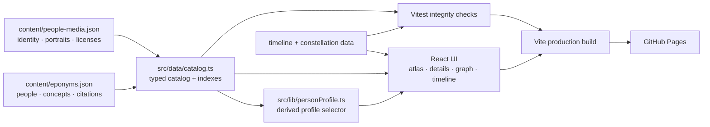

# Architecture / 架构

AI Eponym Atlas is a static React + Vite application backed by two auditable
JSON catalogs. Stable IDs connect people, concepts, timeline events,
relationship-graph nodes, and media records.

AI Eponym Atlas 是一个由两份可审计 JSON 目录驱动的 React + Vite 静态应用。人物、概念、时间线、关系图和媒体记录通过稳定 ID 连接。

## Data flow / 数据流



## Canonical sources / 权威数据源

| Source | Responsibility |
| --- | --- |
| `content/eponyms.json` | Project metadata, people, concepts, relationships, bilingual explanations, and concept-level reference links |
| `content/people-media.json` | Wikidata identity records, verified local portrait files, original URLs, creators, licenses, alt text, and verification dates |
| `src/data/timeline.ts` | Curated publication, naming, people, and AI-adoption events |
| `src/data/constellation.ts` | Small, editorial homepage sample derived from valid catalog concept IDs |

UI components must not duplicate editorial entries. New people and concepts
belong in the canonical JSON catalogs.

组件不应复制编辑条目；新增人物与概念必须进入权威 JSON 目录。

Concept citations support the definition, historical attribution, and modern
use claims attached to that concept. They are not silently promoted into
full-person biography citations. Likewise, a Wikidata URL is an identity record
used to disambiguate the person, not a complete biographical source.

## Runtime modules / 运行模块

| Area | Key files |
| --- | --- |
| Routing and composition | `src/App.tsx`, `src/hooks/useHashRoute.ts` |
| Typed catalog | `src/data/catalog.ts`, `src/types.ts` |
| Atlas search and filters | `src/components/AtlasExplorer.tsx`, `src/lib/search.ts` |
| Guided learning paths | `src/components/LearningPathsPage.tsx`, `src/components/HomeGuide.tsx`, `src/data/learningPaths.ts` |
| Concept and person details | `src/components/ConceptDetail.tsx`, `src/components/PersonDetail.tsx`, `src/lib/personProfile.ts` |
| Relationship graph | `src/components/GraphExplorer.tsx`, `src/components/GraphExplorer.css`, `src/lib/graph.ts`, `src/lib/graphLayout.ts`, `src/lib/graphViewport.ts` |
| Timeline | `src/components/TimelineView.tsx`, `src/components/TimelineView.css`, `src/data/timeline.ts` |
| Localization | `src/copy.ts` and bilingual catalog fields |
| Design system | `src/styles.css`, `docs/DESIGN_SYSTEM.md` |
| Static discovery pages | `scripts/generate-static-pages.mjs`, generated `dist/sitemap.xml` |

## Routes / 页面

The interactive application uses hash routing so direct links remain compatible
with static GitHub Pages hosting. Production builds also create bilingual,
metadata-rich HTML entry points for every concept and person. These pages add
canonical URLs, Open Graph metadata, structured data, `hreflang` links,
readable no-JavaScript content, and redirects into the matching interactive
route. The same build step generates the complete sitemap.

| Route | View |
| --- | --- |
| `#/` | Homepage, reader entry points, and a curated starting set |
| `#/atlas` | Searchable concept and people atlas |
| `#/paths` | Four guided, pedagogical concept sequences |
| `#/concept/:id` | Concept detail |
| `#/person/:id` | Person profile with bilingual introduction, localized facts, terms carrying the name, deduplicated AI applications, and concept-grouped evidence |
| `#/graph` | One- or two-hop relationship graph |
| `#/timeline` | Filterable historical timeline |
| `#/about` | Editorial method |

Graph state encodes focus, depth, visible entity types, and selection. Timeline
state encodes event kind, era, and selected event. Replacing the current hash
entry during interaction keeps each view copyable and restorable without
polluting browser history.

## Visual truth and generated assets / 图形真实性

- Definitions, formulas, labels, relationship edges, timelines, and controls
  are code-native HTML or SVG.
- The current catalog uses 78 real, source-verified open portraits and 39
  labelled monogram fallbacks.
- Generated historical likenesses are not used; a monogram remains visible
  when identity or globally reusable image rights cannot be verified.
- Generated imagery is permitted only as a decorative editorial layer with no
  informational role.
- Generated-asset prompts and transformations are recorded in
  [`GENERATED_ASSETS.md`](./GENERATED_ASSETS.md).

## Integrity checks / 完整性检查

`npm run check` runs TypeScript, Markdown linting, Vitest, the production build,
static discovery-page generation, and bundle budgets. Tests cover:

- unique and bidirectional IDs;
- valid related-concept and timeline references;
- bilingual fields and source minimums;
- strict KaTeX parsing, guided-path IDs, and locale-aware routes;
- complete person-profile derivation, application deduplication, and source
  grouping;
- portrait identity, provenance, license, and local-file records;
- relationship-graph semantics and collision-free two-hop layouts;
- graph camera bounds, viewport transforms, and deterministic layout;
- timeline event chronology, era membership, kind totals, and localized years;
- homepage constellation/catalog synchronization; and
- generated visual asset paths, formats, and size budgets.

Portrait discovery remains an explicit maintenance operation rather than a
runtime dependency. Run
`npm run portraits:audit -- --search --accepted-only` to report candidates from
Wikidata and Wikimedia Commons; every reported image still requires manual
identity and file-license review before it enters the media catalog.

## Repository map / 仓库地图

```text
ai-eponym-atlas/
├── content/                 canonical editorial and media catalogs
├── public/
│   ├── illustrations/       decorative editorial artwork
│   ├── portraits/           bounded, audited local portraits
│   ├── brand-mark.png
│   └── og-card.jpg
├── src/
│   ├── components/          React views and reusable UI
│   ├── data/                typed catalog, timeline, and small UI datasets
│   ├── hooks/               hash routing and interface state
│   ├── lib/                 profile selectors, search, graphs, layout, and tests
│   ├── App.tsx
│   └── styles.css
├── scripts/                 auditable asset-maintenance scripts
├── docs/                    policies, audits, architecture, and deployment
├── design/                  visual-integrity policy for design studies
├── .github/workflows/       CI and GitHub Pages deployment
├── CONTRIBUTING.md
├── package.json
└── vite.config.ts
```

Generated UI mockups are not shipped. The repository keeps only code-native
product screenshots and decorative generated assets whose non-informational
role is documented.
